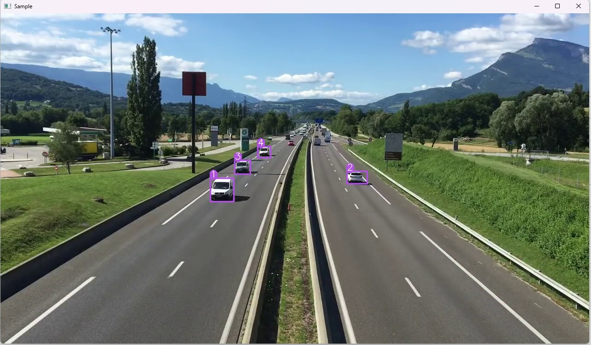

# YOLO-AS-One

## Installation

```
conda create --name yolo python=3.10 -y
conda activate yolo

pip install torch torchvision torchaudio --index-url https://download.pytorch.org/whl/cu121

pip install asone
```

https://pytorch.org/get-started/locally/

conda info --envs

conda env remove --name yolo -y

# Test

```
python main.py data/sample_videos/test.mp4
```


