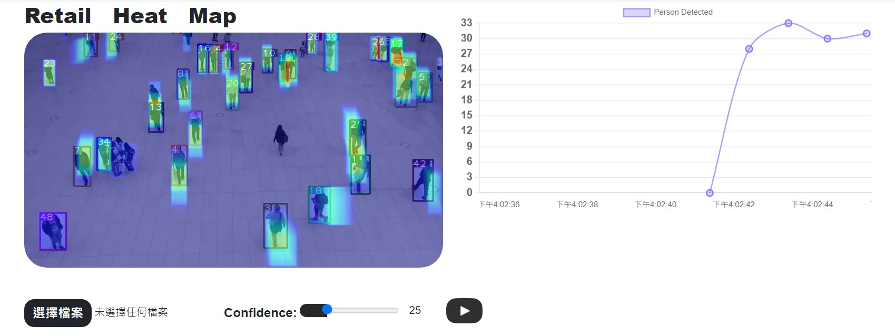

# YOLO-Heat-map

## Installation

```
conda create --name yolo python=3.10 -y
conda activate yolo

pip install torch torchvision torchaudio --index-url https://download.pytorch.org/whl/cu121

pip install asone

pip install streamlit

pip install flask
pip install flask_wtf
pip install flask_bootstrap
pip install flask_socketio
```

https://pytorch.org/get-started/locally/

conda info --envs

conda env remove --name yolo -y

# Test

use SocketIO

```
python flaskApp.py
```


