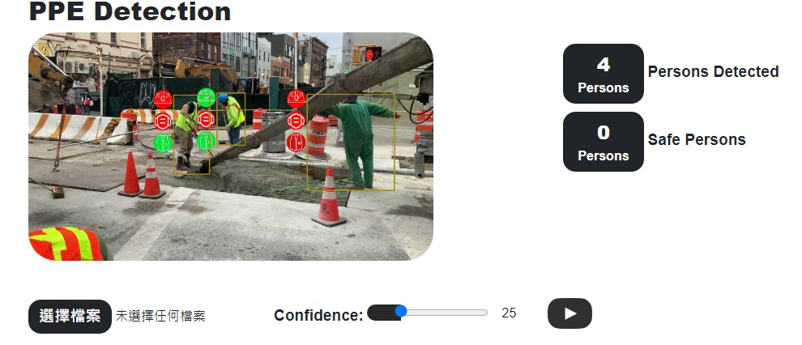

# YOLO-PPE-Detection

Personal Protective Equipment

## Installation

```
conda create --name yolo python=3.10 -y
conda activate yolo

pip install torch torchvision torchaudio --index-url https://download.pytorch.org/whl/cu121

pip install asone

pip install flask
pip install flask_wtf
pip install flask_bootstrap
pip install flask_socketio
```

https://pytorch.org/get-started/locally/

conda info --envs

conda env remove --name yolo -y

## Test

```
python flaskApp.py
```



## Datasets

https://universe.roboflow.com/liug0019-e-ntu-edu-sg/ppe-mask-glove-mergev2
